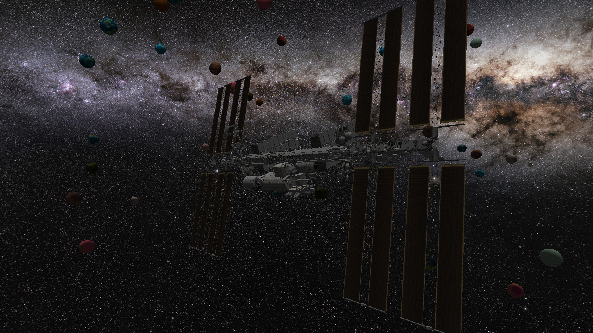

# WebECS

A basic 3D rendering framework made with WebGPU. As suggested by the name, it uses an underlying ECS architecture to organise components

This repo consists of not only the framework, but a working demo

# References

- ISS Model from https://solarsystem.nasa.gov/gltf_embed/2378/
- Planet textures from https://www.texturesforplanets.com/texture-packs.shtml
- Cat loading gif from https://tenor.com/en-GB/view/cat-spinning-gif-10232413348886076857
